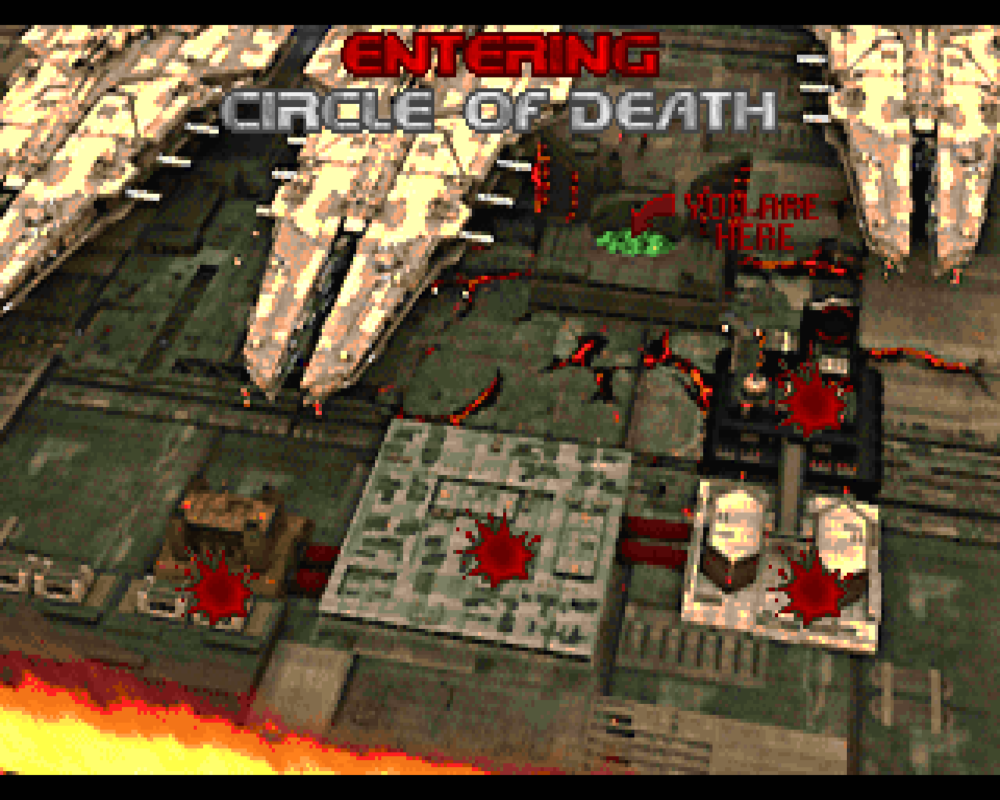

# Comprehensive list of changes in 2022 Spring Refresh

**Note:** the changes this document describes are in comparison to 2021 version of Tartar.
Changes included with the 2021 version are described in [CHANGES](doc/changes.md).

## Menu

- Additional key bindings submenu for palette and screenshot-related commands has been added
- Select WAD menu entry under Features has been removed
- New compatibility option for MBF "mushroom explosion" has been added under Eternity Options 

## Sound

- Sound effects cache is refreshed every time new wad or set of wads is added to register all newly added sounds
- Pistol sound is no longer used as substitute for every missing sound
- When recoverable issues are encountered during MUS file conversion to MIDI, instead of stopping the music for level, attempt to go on with the conversion

## Video

- TRANMAP is not generated nor used at all in case when "checkered" transparency is enabled with r_fauxtrans CVAR
- TRANMAP is no longer cached between runs and is instead generated using the palette of currently loaded WADs or upon on the fly palette switch; it is still saved to disk every time e.g for the purpose of being used as a lump
- -safe command line argument prevents page flipping from being used regardless of the setting in Video Options; one use case for this is when running in DOSBox with 1280x1024 resolution selected
- Palettes from currently loaded WADs can be cycled through on the fly with new bindable pal_next, pal_prev console commands. PLAYPAL, COLORMAP (and TRANMAP in case translucency is enabled) lumps are cycled in sync while cycling through palettes.
- If players increase screen size past "fullscreen" (i.e. screen size with BOOM-style HUD appearing instead of status bar) newly implemented "extended" screen size is selected for which Tartar will attempt to take advantage of all available screen space to show both "fullscreen" player view and status bar; HUD will not be displayed in this screen size. See below examples of output with different display sizes in 1280x1024 resultion.

  _"Full", "extended" and "normal" screen sizes (left to right)_

  _Same with 4x3 aspect ratio switched on in Video Options_

## System

- Keypress processing has been reorganized to allow bindable console commands in most of the game screens, including title screen and intermission
- FreeDOOM, FreeDM, TPD and HacX WAD names have been added to the list of IWAD filenames Tartar searches for during startup
- Overlay HUD is initialized earlier and operates on more game screens; only relevant widgets will be shown, e.g. no crosshairs in title or intermission screens 
- BOOM-style HUD variant is no longer toggled by pressing + when already at max screen size; players can still use F5 key for that
- Screenshot taking is no longer a "game action" (one example of a game action is  finishing a level) and bindable SCREENSHOT CCMD has been added for taking screenshots 
- Screenshot filename is output in console every time a screenshot is saved and no sound is produced anymore
- New -tape command line argument allows to specify a single WAD to be loaded before all other WAD-s (before both PWAD-s and the IWAD) in such way that its lumps are "immutable" and cannot be ovrridden by lumps with the same names from subsequently loaded WAD-s. This can be used to patch a certain lump with some specific contents regardless of WAD-s load order and without influencing lump numbering, the most obvious use case being including updates to FraggleScript or mapinfo by patching map marker lumps.
- Build has been switched to RELEASE configuration and extra checks around array sizes and memory management are not compiled in by default

## WADS compatibility

- Doom 2 PWADs with more than 32 maps are supported
- WADs with SS_/FF_START but no corresponding S_/F_START lumps are supported
- Maps with empty REJECT lumps no longer crash the game
- Maps with more that 32k sides or lines no longer crash the game (e.g. Eviternity Dehydration or Imperator can be loaded)
- When loading a map that Tartar would not be able to handle (e.g. one with subsectors not defined) it drops to console showing an error message rather than crashing
- Texture definition checks are now more relaxed and Tartar would log the errors it detects rather than quit immediately; related error messages are now also more friendly
- Upon encountering textures with missing patches or sprites with no rotations when loading wads Tartar would no longer immediately quit or crash
- New command line argument -nodemo has been added for the player to suppress demo playback if it's found to be choppy or jittery for particular WADs
- Commander Keen suffering sounds have been restored
- Chaingunner attack sound has been restored; the special chaingun sound is only used for the attack in Eternity TC mode or with Caverns of Darkness loaded
- Eternity TC actors would now be spawned only while in Eternity TC mode or with Caverns of Darkness loaded; CoD actors would only be spawned when CoD is loaded with certain actors replacing Eternity TC ones in case the same Doomednum is used for both
u

## Gameplay changes and bugfixes

- Automap shows correct level time, not an arbitrary value like before
- BEX-style string definitions without a space before equals sign are correctly processed
- Mnemonically-specified flags (and flags2) for Things (bits and bits2 attributes to be exact) in DEH patches are now applied
- DEH attributes parsing for Things uses non-case-sensitive comparison and tolerates both presense of spaces and absence of spaces before equals sign
- Encountering unknown codepointer name in DEH file no longer causes a crash
- Collected arms numbers in status bar (the small yellow ones) use correct background
- "Intelligent" blood recoloring has been adjusted:
    - Chex player bleeds yellow, not green
    - Players with Godmode bleed yellow, not red
    - Roaches bleed green, not red
- Starting the game with -devparm no longer locks it up at an early stage and allows game to run despite severe error detected (up until the stage where it eventually crashes) rather then quit immediately
- For Doom 2 WADs (i.e. the ones with MAPXY level marker lump names) Tartar attempts to detect the final level of the loaded WADs to finish the game and show cast roll after this final map has been completed by the player; this can be switched off with detect_finallevel configuration parameter in TARTAR.CFG

## Extras

- -noload command line argument prevents any of the extras to be autoloade
- WADs found in FILTERS directory will be loaded automatically upon startup with all but PLAYPAL, COLORMAP and TRANMAP stripped from them. These have special treatment and will not override the lumps from WADs players may have loaded with -file command line argument, but will be available for on the fly palette cycling with pal_next. Use pal_list console command to print the list of loaded palette WADs (both player-specified and extras). 

  _PLAYPAL from GINZA.WAD and WALDEN.WAD (left to right) cycled while in a HacX map_

- If both SELFIE.WAD and SELFIE.DEH from Instadoom are found side by side with TARTAR.EXE, players are given selfie stick and can switch to it for selfie-making with bindable selfie CCMD. All other weapons, including plasma gun and BFG, retain their normal behaviour. Press Fire to take selfies with the stick out; taking selfie makes 3 screenshot and does not require ammo; to remove the stick just switch to any other weapon.

- [Doom 2 intermission maps](https://www.doomworld.com/forum/topic/129057) by @olyacim are supported, however as the author is still working on the version with patch-based graphics, the support was only tested with an experimental modified version renamed to D2INTMAP.WAD. When D2INTMAP.WAD is found side by side with TARTAR.EXE and no PWAD-s are loaded with DOOM2.WAD, intermission screens will use images by @olyacim with blood splats and "you are here" arrow. Secert maps use standard DOOM2 INTERPIC as background for intermission screens. If any PWAD is loaded standard INTERPIC is used for all maps; newly introduced -wimaps command line switch can be used to force D2INTMAP.WAD graphics to be used even with PWAD-s.  

  _4 out of 5 levels of DOOM II 2nd "episode" conquered_

- Unless -noload is specified or -tape command line argument is explicitly provided, the each WAD from list of WAD-s to load at startup (both IWAD and PWAD-s) is checked for presence of a "helper" WAD with the same name in TAPE directory side by side with TARTAR.EXE. The first such "helper" WAD (if any are found) is loaded before all other WAD-s (IWAD and PWAD-s) and its lumps are then treated as immutable (as described above in section on -tape command line argument). This is to  include with Tartar "helper" WAD-s that would improve players' experience with popular PWAD-s or remediate their incompatibility with this source port. For example, Tartar ships with such "helper" WAD-s for No Rest for the Living (NERVE.WAD) and A Long Trek Back Home (LONGTREK.WAD) in GOODIES directory of the binary distribution. 

## New CVARS, CCMDS and configuration parameters

- pal_curr CVAR
- pal_next, pal_list, pal_prev console commands
- screenshot console command
- selfie console command
- detect_finallevel configuration parameter
- comp_mushroom CVAR and configuration parameter
- -nodemo command line switch
- -wimaps command line switch
