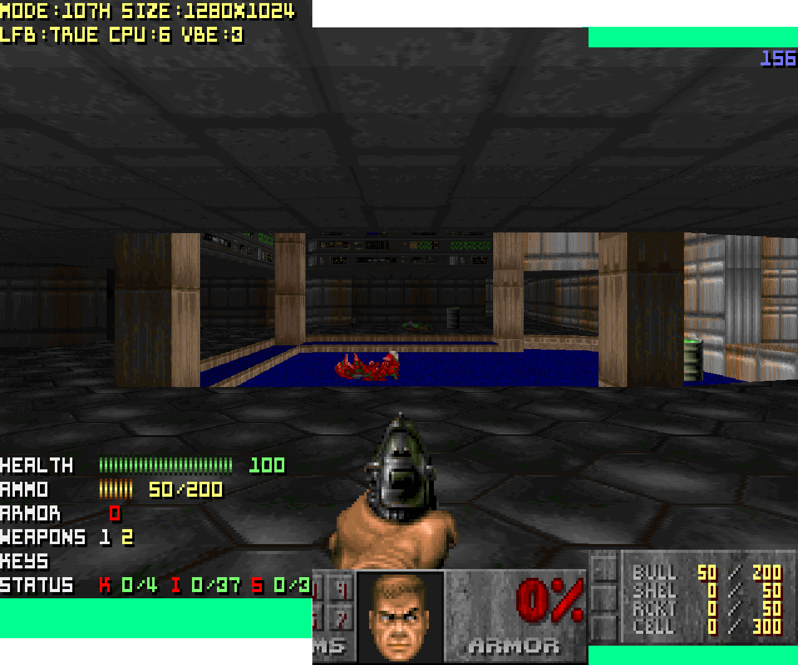
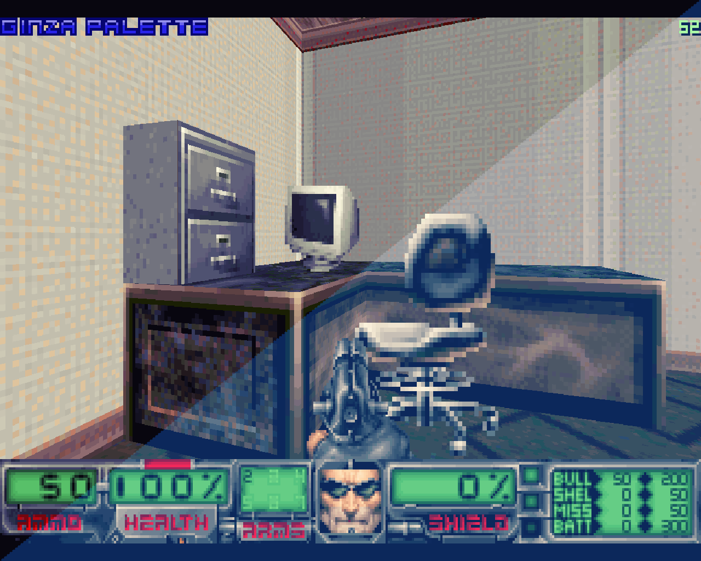

# Comprehensive list of changes

This file contains the description of what has been changed in Tartar 
as compared to the sources of Caverns of Darkness that Joel Murdoch has 
made available as COD10SRC.ZIP. 

## Menu 

### Features menu item has been moved from main menu into Options
  
  This was done because TCs for vanilla Doom and Chex do not provide a patch
  for Features, and it looks very out of place as a result

### Currently selected item in options menu is now flashing
  
  Again, TCs for vanilla Doom and Chex use colored images for font glyphs 
  that dont's translate into one of the CR_... colors
  which makes selected menu item in Eternity options indistinguishable
  from other items

### Bugfix: entry of special characters in menus is no longer possible

  This was especially apparent if one used Shift when entering savegame
  name

### New entry "Load WAD" added to Episode selection menu

  By default Eternity would start a new game not from E1M1 or MAP01
  but from the first changed map it detects if pwads with maps are 
  loaded. This means that loading Tech Gone Bad would result with new
  games starting from E1M8, and if Sigil Compat is loaded, new games
  will start from E2M1 in Doom 1. Unfortunatelly, this is less useful
  for pwads that modify several episodes. For example Alients TC would 
  start from E1M1 and not E2M1 as one would expect. In Tartar, when 
  starting new Doom 1 game player can always select the desired episode. 
  There is also an additional entry in the menu Load WAD (named so because
  author didn't want to add new patches to the resource wad) that 
  will trigger default Eternity behaviour. With Doom 2, Final Doom and 
  Chex new games always start with the first changed map when a pwad
  with maps is loaded.
 
### Additional key bindings 
  
  Additional key bindings submenu for palette and screenshot-related commands 
  (and jumping) have been added under Key Bindings/Extras.
  
### Select WAD menu entry under Features has been removed
  
  It never worked in the first place

### New compatibility options 
  New compatibility options have been added under Eternity Options to control:
  - MBF "mushroom explosion" compatibility
  - Checking every special line player crosses, including if player is blocked
    from moving by a wall or other object 
  - SMMU colored lighting
  - Experimental support for rendering of textures with tall patches

### Character rendering suited for fonts with height of up to 10 pixels
  
  Option menus and Save/Load Game menus are more spacious and allow character 
  glyphs of up to 10 pixes in height to be output without getting cut by screen
  borders. Because of this some of the empty space that was used for menu 
  formatting is now gone and Compatibility menu is split into two screens.
  Players can go into the second screen via "MORE..." entry at the bottom of 
  the first one.
  
  Author's goal with this change was primarily to support Ancient Aliens fonts.

### Menus background change

  Menu background is using the same texture MBF and subsequent versions of
  Eternity Engine used. In case when Caverns of Darkness are loaded or
  Tartar is in Eternity TC mode, the background used in SMMU and the version of
  Eternity Engine Tartar is based on will be used as before.

### Quick save and quick load has been restored (again)

  Options to assign Quick save and Quick load keys have been restored in
  the Options menu under Key Bindings/Environment and KEYS.CSC shipped with 
  all versions of Tartar has been updated to include default key assignment 
  for them, making quick save and quick load features operate in Tartar 
  for all players out of the box.

## Sound

### Updated Alegro library and sound routines 

  [ALLEGRO.H](/ALLEGRO.H) in Tartar comes from the version of Allegro found in 
  [MBF 2.0.4](https://www.vogons.org/viewtopic.php?f=24&t=40857), and Tartar
  binaries are linked with liballegro produced from the sources that 
  the author of MBF 2.0.4 has shared. System dependent sound code has been
  replaced with that from MBF 2.0.4. This single change was the main driver 
  of the effort by the author, as he found previously available build of 
  Cavens of Darkness to be somewhat unstable when it came to sound and music 
  on a modern "Frankenstein" gaming system in native DOS. 
  
  For those curious, target system for Tartar development was eqipped with
  a Yamaha YMF744B-R based PCI sound card and an X3MB MIDI synthesizer
  connector to the MPU-401 port of the said card. It was intended to be used
  in Windows 98 with VXD drivers by Yamaha and in DOS with DSDMA utility.

  Please refer to [MBF 2.0.4 changelog](COPYRGHT\MBFUP204.TXT) for the details 
  on Allegro changes. Tartar source code does not include modified Allegro 
  sources.

### Sound and MIDI card options have been removed from Sound options

  Following the "change in policy" from MBF 2.0.4 sound code inclusion 
  it is no longer possible to select sound card in Tartar options menu. 
  Instead player should use a separate SETUP.EXE configuration utility. 
  This utility is taken as is from MBF 2.0.4 in Tartar distribution and 
  produces SETUP.CFG file (similar to ALLEGRO.CFG file that original 
  ASETUP.EXE from Allegro library produced).

### Sound caching is no longer optional and option is gone from Sound options
  
  With MBF 2.0.4 lowlevel sound routines inclusion, sound effects are always
  cached at the start of the game. Option to control this is now gone.
  
### Sound effects cache is refreshed every time new wad is added
  
  Sound effects cache is refreshed every time new wad is added or set of wads 
  is added to register all newly added sounds
  
### Pistol sound is no longer used as substitute for every missing sound

### Sound effects are no longer padded with noise to ensure set length

### MUS file conversion failure are more graceful

  When recoverable issues are encountered during MUS file conversion to MIDI, 
  instead of stopping the music for level, attempt to go on with the conversion
  
### WAV sound format is supported

  Sound effect lumps in WAD format are read and both 8-bit and 16-bit
  samples are supported. Paired with Allegro's support of 16-bit cards
  this allows for much clearer sounding sound effects in mods, such as 
  for example [Doom Sound Bulb](https://www.doomworld.com/forum/topic/110822).
  Tested with DOSBox SoundBlaster 16 emulation and SB Audigy VxD in Windows 9x.

### Sound effects are no longer padded to set 

## Video

### VESA-based lowlevel routines replace Allegro ones for video

  Low-level system video routines have been replaced by those developed 
  by Gerwin for [MBF 2.0.4](https://www.vogons.org/viewtopic.php?f=24&t=40857).
  The new routines use VESA API calls instead of Allegro library functions 
  and have improved video cards compatibility. 
  
  For the list of cards tested with MBF 2.0.4 please consult the included
  changelog for that port, however it should be noted that Tartar's
  author was able to get high resolution modes work with the embedded
  video card by Intel that he had on the target system, which did not work
  with the DOS source ports he had previously tried. 

### Video mode selection options are gone

  It is no longer possible to directly select video mode in the options menu.
  Instead following MBF 2.0.4 example, video mode selection is done based
  on the combination of options that player sets in options menu. These options 
  are described in this section, and there is also a separate section of this 
  file with the list option combinations recommended for some specific cases.

### C video, screenshot, renderer and graphics routines have been generalized

  All C routines that had high resolution mode supported (i.e. 640x400 
  resolution in addition to 320x200) have been updated to support 
  any resolution that is a power of 2 multiple of 320x200. In practical 
  terms this means 1280x800 is now supported, but in theory these functions 
  could work with e.g. 2560x1600 as well. 

  This is **not true** for Assembler functions, which have only been provided
  for the newly introduced 1280x800 renderer resolution. So adding new hi-res
  modes is sadly not just a matter of extending available configuration 
  options. 

### Renderer resolution option has been added

  Player can choose to render to screen buffer of the following dimensions:

  - 320x200   rendered image will be output in 320x200 resolution
  - 640x400   rendered image will be output into 640x400 resolution if 
              supported otherwise will be output into 640x480 resolution 
              with black bars on top and bottom
  - 1280x800  rendered image will be output into 1280x1024 resolution
              with black bars on top and bottom

  The following CVAR values are supported for selecting resolution 
  v_hires: 0, 1, 2. The same can be setup with hires configuration file option.

### Option for scaling to higher resolution has been added
  
  If activated the following scaling will be performed:

  - 320x200   rendered image will be scaled to 640x400 
              and output into 640x400 resolution if supported
              otherwise will be output into 640x480 resolution
              with black bars on top and bottom
  - 640x400   rendered image will be scaled to 1280x800 and output
              into 1280x1024 resolution with black bars on top and bottom
  - 1280x800  rendered image will not be scaled and still be output
              into 1280x1024 resolution with black bars on top and bottom

  Game resolution will be selected accordingly. No interpolation or filtering 
  is performed while scaling; each pixel is simply drawn as 2x2 block of the
  same color. 

  Scaling of screen buffer is done in RAM, after which scaled screen buffer
  contents are sent into video card's memory. This means that
  while less CPU intensive, scaling will still require at least one
  larger size screen buffer, and thus more memory than with scaling off
  at the same renderer resolution.

  CVAR to enable/disable scaling is v_scale_hi, scale_to_hires is the 
  corresponding option in the configuration file.

### Option for stretching to a 4:3 resolution has been added
  
  If activated without scaling to higher resolution:
  - 320x200   rendered image will not be changed
  - 640x400   rendered image will not be changed if video card supports 640x400 
              resolution, otherwise it will be stretched and output into 
              640x480 _without_ black bars on top and bottom
  - 1280x800  rendered image will be stretched to 1280x960, and output 
              into 1280x1024 with black bars on top and bottom,
              bars being narrower than for an unstreteched 1280x800 image 
              
  No interpolation or filtering is performed while stretching.
  In fact stretching is performed by outputting some of the screen
  buffer lines twice. I.e. without scaling to higher resolution
  on some of the lines pixels will be drawn as 1x2 blocks of the same
  color. With scaling to higher resolution, on the same lines pixels
  will be drawn as 2x3 blocks of the same colors, rather then 2x2 
  blocks as on other lines.

  CVAR controlling this is v_scale_aspect, and this can be also set
  with scale_aspect option of the configuration file.

### Screenshot functions respect video scaling options
  
  Saving a screenshot will result in the same image as being output to the 
  screen, as screenshot functions will perform the same scaling as screen 
  output functions do.

### Video page flipping can be explicitly set in Video options
  
  As in MBF 2.0.4, the option to enable page flipping via VESA API call in 
  low-level vieo routines has been added. CVAR v_page_flip and 
  configuration file option page_flip can be used to control it. 

### Waiting for retrace now follows MBF 2.0.4 logic 
  
  Waiting for retrace (vsync) will be attempted in page flipped modes only,
  as this is the behaviour of the incorporated MBF 2.0.4 low level video 
  routines.

### Option to show flashing disk icon when loading has been removed
  
  Unlike Allegro counterparts, MBF 2.0.4 low level video routines do not have 
  generic purpose blitting functions, so rendring sprites at arbitrary moment 
  in game life cycle is no longer possible. One such case was the flashing 
  disk/CD-ROM icon, and as it's no longer supported, option is gone for it 
  from the menu.

### Option to show FPS counter has been added to Video options
  
  Low-level video routines from MBF 2.0.4 include code for FPS measurement.
  Unike MBF 2.0.4, Tartar uses SMMU HUD widget to render FPS values,
  so even if option is active, FPS counter will only be visible in game 
  and during demos, but not in title screen or menus. One can use 
  v_show_fps CVAR and show_fps configuration file option to switch FPS 
  output on or off.  

  If FPS counter is on, Tartar will additionally display current video settings
  (including actual mode that was configured) after they have been changed, 
  or for a few seconds after new level was started or a saved game was loaded.

### Timed demo benchmarks have been removed from Video options menu 
  
  On one hand author has never been able to get them working, on the other
  these were referring to the benchmark scores tied to a certain set of 
  video modes which no longer made sense with the changes described above. 
  This change has only removed timed demos from Options menu. Running with 
  command line arguments or from Features menu should still be possible. 

### Command line options from MBF 2.0.4 have been added
  
  - -nolfb   avoid using LFB modes with VESA routines 
  - -nopm    avoid using PM VESA functions
  - -safe    try the most compatible settings for video card
             also (specific to Tartar) avoid using paging
  - -asmp6   choose P6-specific assembler optimized code for 
             copying memory blocks regardless of the detected CPU family

### Option to stretch skies is now persisted in configuration file
  
  Configuration file option stretchsky has been added to store it.

### "Checkered translucency" has been added
  
  New translucency mode has been added that does not use TRANMAP file.
  Instead it renders either odd or even pixel of sprites and textures,
  depending on the number of line being drawn. This results in 50%
  translucency effect when used with intended equipment, e.g. a CRT
  VGA display at high enough resolution (1280x1024 would do).

  
  _Photo demonstrating the resulting effect_
  
  Column and span rendering functions have been provided as well 
  as functions for rendering sprites with translated colors and
  for particles. 
  
  One limitation is that translucency is not "additive", which means 
  that translucent objects act as opaque for other translucent objects
  and will block them. Also, in addition to applying this to all 
  objects in game for which general transparency applies, code applies 
  this to player sprites (arms) when in invisible state. Fuzz-ed objects 
  like Specter or other players with Invisibility powerup are rendered
  with the slightly modified fuzz effect. 
  
   
  _comparison of no transparency, tranmap-based general transparency 
  and "checkered" transparency_  
  
  To use this mode first enable general translucency in the option
  menus, and then either set r_fauxtrans CVAR or change faux_translucency
  option in the configuration file.

### Experimental "water transluency" code can been compiled in

  Please note that this feature is not compiled in the reselase versions of
  Tartar by default.  

  When enabled this which causes experimental ("no feature") code 
  for rendering Boom-style  (i.e. line type 242) deep water surface as 
  translucent to be included. In fact this code results in nothing 
  resembling translucent water surface even if it is enabled explicitly 
  with r_watertrans CVAR or water_translucency option in the configuration 
  file, both of which are off by default. This will also only work if 
  general translucency is enabled in options. 
  
  The TRANWATER preprocessor define is not set for compiling Tartar,
  since otherwise this enables broken, "no feature" code.

### TRANMAP is not generated in case when "checkered" translucency is enabled

  When "checkered" translucency is enabled with r_fauxtrans CVAR,
  translucency map file (TRANMAP) is neither generated nor used at all.

### TRANMAP is not cached between runs 

  Translucency map file (TRANMAP) is no longer cached between runs and 
  is instead generated using the palette of currently loaded WADs or 
  upon on the fly palette switch; it is still saved to disk every time 
  e.g for the purpose of being used as a lump
  
### Page flipping is never used if -safe command argument is present
  
  -safe command line argument prevents page flipping from being used 
  regardless of the setting in Video Options; one use case for this is 
  when running in DOSBox with 1280x1024 resolution selected

### Palettes (PLAYPAL-s) can be cycled on the fly when multple are loaded

  Palettes from currently loaded WADs can be cycled through on the fly 
  with new bindable pal_next, pal_prev console commands. 
  PLAYPAL, COLORMAP (and TRANMAP in case translucency is enabled) lumps 
  are cycled in sync while cycling through palettes.
  
### New screen size beyond "fullscreen"

  If players increase screen size past "fullscreen" (i.e. screen size 
  with BOOM-style HUD appearing instead of status bar) 
  newly implemented "extended" screen size is selected 
  for which Tartar will attempt to take advantage of all 
  available screen space to show both "fullscreen" player view and status bar;
  HUD will not be displayed in this screen size. 
  See below examples of output with different display sizes 
  in 1280x1024 resultion.

  _"Full", "extended" and "normal" screen sizes (left to right)_

  _Same with 4x3 aspect ratio switched on in Video Options_

### Fuzz effect is more pronounced now
  
  Fuzz effect is more "blocky" in higher resolutions, making Specters and 
  invisible other players look less "airy" and also hopefully reducing
  noticeable artifacts and "moire" with the effect itself.
  
  More on the issues with fuzz effect as ID have implemented it can probably
  be found n the apocryphical "Why I left Doom, Lee Killough May 1999.htm",
  but alas author does not have a copy of that.

### Graphics are clipped to screen boundaries when rendered

  Strict validation of patches (graphics) boundaries is gone, in particular
  for vertical extents. This was done to more easily handle rendering outside
  of the conventional game view rectangle that is a multiple of 320x200 
  after the new more extensive screen size was introduced, that places
  status bar below that rectangle.
  
  If extents of the patch (grpahics) to be rendered fall outside of screen,
  only the visible part will be output. This in particular allows for
  rendering of wide-screen friendly assets from more modern WAD-s.

  No error message spamming occurs in for boundaries checking when
  rendering patches (graphics).
  
### Experimental support for tall patches

  Normally Doom graphics format, as handled by vanilla Doom and Boom by default,
  has an image height limitation of 255. Subseqently released source ports
  like PrBoom++ include support of the technique known as "tall paches" that 
  allows to remove the height limitation, while keeping the image binary format.
  
  While Tartar retains the "classic" patches drawing routines it has inherited 
  from Eternity Engine version it is based on, the "tall patches" technique 
  support has been added for the two specific cases below:
  
  - Drawing of game actor graphics (monsters, pick ups and other assets in 
    the map) and middle textures of 2-sided walls (these are often "grills" or
    "vines" and the like) are always rendered with "tall" format support and 
    thus images with source height of more than 255 pixels are output.
  - For top and bottom textures as well as for middle textures of 1-sided walls
    (which are normally your brick, mortar, wood, etc) rendering with "tall"
    format support can be enabled with comp_talltex compatibility CVAR, which
    can be set through "Workaround for tall textures" option under Eternity 
    Options menu or via configuration file property with the same name. It
    is recommended that Tartar is restarted after this option is toggled.

### Rendering troubleshooting aids

  Please note that this feature is not compiled in the reselase versions of
  Tartar by default.  
  
  Tartar introduces a set of debugging aids to help narrow down certain
  glitch or crash to a particular feature of the scene being rendered.
  When compiled with NORENDER preprocessor define, Tartar gets a -norender
  command line argument that activates a range of CVAR-s and debugcolumn 
  CCMD.
  
  - r_norender1          - switches sky rendering on or off
  - r_norender2 [number] - when number is set to a non-negative value
                           only the screen column with that number 
                           will be shown (numbering starts with 0)
  - r_norender3          - switches sprites rendering on or off 
  - r_norender4          - no action
  - r_norender5          - switches top textures rendering
  - r_norender6          - switches mid textures rendering
  - r_norender7          - switches bottom textures rendering
  - r_norender8          - switches masked textures rendering
  - r_norender9          - switches floor and ceiling rendering
  - r_norender0          - switches all of the above on/off at once
  - debugcolumn          - dumps information on visplanes and clipping
                           for a single particular screen column
                           set with r_norender2; needs -debugfile
                           
  It is advised that KEYS.CSC is used to assign keys for activatning the
  various rendering aids and triggering column rendering dump.
  
  
## Recommended video options for common use cases

Tartar only supports video modes with 8 bits per pixel, that is ones 
capable of displaying 256 colors at once.

### 1. Original 320x200

Player has authentic retro or otherwise performance sensitive hardware,
or interest in classic vanilla/BOOM/MBF experience.

- Renderer resolution - 320x200
- Scale to higher resolution - No
- Aspect ratio to scale to - Original

320x200 resolution will be configured by Tartar.

### 2. Classic MBF hires

Player has access to slightly more powerful hardware including 
a videocard that supports 640x400 and preferrably a CRT display.

- Renderer resoltion - 640x400
- Scale to higher resolution - No
- Aspect ratio to scale to - Original

640x400 resolution will be configured by Tartar.

### 3. MBF hires on a less compatilble computer

Player has access to slightly more powerful hardware but
but their videocard only supports 640x480 and not 640x400.

- Renderer resoltion - 640x400
- Scale to higher resolution - No
- Aspect ratio to scale to - 4:3

640x480 resolution will be configured by Tartar.

### 4. Gaming system with a retro LCD monitor attached

Player has a 1280x1024 LCD display with 5:4 aspect ratio and
hadrware that is fast enough and has enough memory to handle higher 
resolution.

- Renderer resoltion - 1280x800
- Scale to higher resolution - No
- Aspect ratio to scale to - 4:3

1280x1024 resolution will be configured by Tartar.

### 5. Square pixel appreciation on a retro LCD monitor

Player has a 1280x1024 LCD display with 5:4 aspect ratio,
hadrware that is fast enought and has enough memory to handle higher 
resolution, and an appreciation for sprites looking the same they would
look in a graphical editor had they loaded them.

- Renderer resoltion - 1280x800
- Scale to higher resolution - No
- Aspect ratio to scale to - Original

1280x1024 resolution will be configured by Tartar.

## Mouse changes

### Option to enable turning smoothing with mouse is now persisted
  
  Configuration file option for it is smooth_turning, same name as for CVAR.

### Even smoother mouse turning
  
  Mouse turning smoothing takes 4 samples into account for _extra_
  smooth turning when smooth turning is activated in options menu.
  Previously 2 samples were used.

### Filtering of mouse movement
  
  Historically Eternity had been suffering from "jerky" mouse movement, 
  as sharp turns by the player could easily result in 360 (or more) degree 
  turns in game. Rather than fixing this at the source as SoM has done 
  in [late 2008](https://web.archive.org/web/20090110014229/http://som.mancubus.net/),
  Tartar author has introduced clamping of exessive mouse readings
  to prevent unexpected turning behavior. This change is specific to Tartar and
  makes mouse turns in Tartar "feel" different from other ports. There is no
  configuration option or CVAR to disable it. 

## System

### _ETERNITY.WAD_ is always loaded as resource wad

  SMMU and Eternity automaticall load the resource WAD file that
  contains sprites, patches and sounds necessary for the source port to work.
  The WAD is looked for using the name of the executable of the port. 
  So, provided ETERNITY.EXE is run, the name of the WAD file to load would be 
  ETERNITY.WAD, but if player renames ETERNITY.EXE to FOOBAR.EXE, the name 
  of the WAD file would be FOOBAR.WAD. Tartar always looks for WAD file 
  named ETERNITY.WAD. 
  
  This allows players to, for example, rename TARTAR.EXE to DOOM.EXE and use a
  front end like DOOM-IT to load maps and mods with it.  

### Configuration and other files are looked for in the directory of the .EXE  

  Tartar looks for files necessary for it to run in the directory where .EXE 
  sits, not in the directory that was current when the .EXE was run. I.e. imagine 
  this directory structure:
  
  C:\GAMES\DOOM2\  
  ...  
  C:\GAMES\DOOM2\DOOM2.WAD  
  ...  
  C:\GAMES\DOOM2\TARTAR\  
  C:\GAMES\DOOM2\TARTAR\TARTAR.CFG  
  C:\GAMES\DOOM2\TARTAR\TARTAR.EXE  

  If player runs the game from C:\GAMES\DOOM2 using command TARTAR\TARTAR.EXE
  Tartar will load TARTAR.CFG and other files it needs from 
  C:\GAMES\DOOM2\TARTAR, and not C:\GAMES\DOOM2. The following files will be 
  picked up from that directory:

  - TARTAR.CFG
  - ETERNITY.WAD
  - SETUP.CFG
  - KEYS.CSC 
  - MBF_D2GM.IBK

  This does not in any way change the way WADS (iwads, or pwads) and DEH/BEX
  patches are looked for or loaded.

### Startup uses system code from MBF 2.0.4 
  
  That startup code has been merged with the one from MBF 2.0.4 probably
  means more stable behaviour when run under Windows NT family OS.
  Author has not tested this however.

### Changing game speed with i_gamespeed CVAR requires a restart

  Scaling of timer tics can still be controlled with i_gamespeed CVAR
  and configuration option realtic_clock_rate. However after MBF 2.0.4
  system code has moved in, it is no longer updated in realtime,
  and requires a restart of the game to be picked up.
   
### CVAR to avoid excessive video and sound updates has been introduced

  Eternity performs video and audio update every game loop, regardless 
  of whether new events to process are available, or next game tic 
  has started as per system timer. Tartar's author is not aware of the
  rationale for this, but annoyed with the absurdly high frame rates 
  in lower sresolution, has introduced new CVAR i_ticwait and 
  configuration option update_after_tic, that limit the updates 
  only to situations,  when new events are available or new tick has 
  been registered by the system timer (the latter is to keep menus and 
  game UI running even when there's no game or demo happenning).

  Author's preference is to run with the CVAR set to on, and little 
  testing that has been carried out has not shown any effect on the gameplay,
  aside from the desired capping of FPS to 35 + ~35/2 (which is around
  50 fps while playing), however to maintain compatibilty with Eternity
  both CVAR and configuration option are off by default.

### Keypress processing has been reorganized 
  Keypress processing has been reorganized  to allow bindable console commands 
  in most of the game screens, including title screen, intermission and 
  automap. This may cause actions to trigger from keypresses in game screens 
  where players would not expect this at all, so author tried his best to 
  ensure players experiece does not suffer and, for example, cheats work as 
  expected.
  
  Additionally, console when opened is displayed on top of all other widgets
  including Menus, and players cannot interact with other widgets than console
  while it is on.
    
### Additional IWAD names to search for on startup
  
  FreeDOOM, FreeDM, The People's Doom and HacX IWAD names have been added 
  to the list of IWAD filenames Tartar searches for during startup.
  
### Overlay HUD is initialized earlier 

  Overlay HUD is initialized earlier and operates on more game screens; 
  only relevant widgets will be shown, e.g. no crosshairs in title or 
  intermission screens, but screen resolution details, for example, 
  will be visible there.
  
### BOOM-style HUD variant choice change
  
  BOOM-style HUD variant is no longer toggled by pressing + when already at max
  screen size; players can still use F5 key for that.
  
### Screenshot taking changes
  
  Screenshot taking changes is no longer a "game action" (one example of a game 
  action is finishing a level) and bindable screenshot CCMD has been added for 
  taking screenshots, as well as Menu option to assign a key to it.
  
  Screenshot filename is output in console every time a screenshot is saved and 
  no sound is produced anymore.
  
### "Helper" WADs introduced
  New -tape command line argument allows to specify a *single* WAD to be
  loaded before all other WAD-s (before both PWAD-s and *even the IWAD*) 
  in such way that its lumps are "immutable" and cannot be ovrridden by lumps
  with the same names from subsequently loaded WAD-s. 
  
  This can be used to patch a certain lump with some specific contents
  regardless of WAD-s load order and without influencing lump numbering, 
  the most obvious use case being including updates to FraggleScript or mapinfo
  by patching map marker lumps.
  
  Additionally a helper WAD will be loaded automatically (unless neiter -tape
  nor -noload command line argument is provided on startup) if case when 
  in the TAPE directory side by side with TARTAR.EXE a WAD file is found with
  the same name as one of the PWAD-s Tartar has on the list of WAD-s to load.
  Only one helper WAD will be loaded, meaning that if two or more PWAD-s
  on the list to load have matching helper WAD-s in TAPE directory, the first
  PWAD on the list gets its helper.
  
  Take for example this directory layout

  C:\GAMES\DOOM2\  
  C:\GAMES\DOOM2\DOOM2.WAD
  C:\GAMES\DOOM2\NERVE.WAD
  ...
  C:\GAMES\DOOM2\TARTAR\  
  C:\GAMES\DOOM2\TARTAR\TARTAR.EXE  
  C:\GAMES\DOOM2\TARTAR\ETERNITY.WAD
  ...
  C:\GAMES\DOOM2\TARTAR\TAPE  
  C:\GAMES\DOOM2\TARTAR\TAPE\NERVE.WAD  
  C:\GAMES\DOOM2\TARTAR\TAPE\LONGTREK.WAD
  
  Then starting Tartar with this command from C:\GAMES\DOOM2
  TARTAR\TARTAR.EXE -file NERVE.WAD
  
  will result in TARTAR\TAPE\NERVE.WAD being loaded before DOOM2.WAD,
  ETERNITY.WAD and NERVE.WAD. 
  
  See [EXTRAS](extras.md) for further notes on usage and information
  about included sample helper WAD-s.
  
### Autoloading of WAD-s, DEH-s and BEX-s (also based on IWAD-s)

  Tartar will automatically add WAD-s, DEH-s and BEX-s found in FIXES 
  directory to the list of files to load, putting them straight after the 
  IWAD on the list of files to load. This is a convenient way to include 
  into file load lists popular fix packs without specifying them manually 
  with -file command line argument.
  
  If inside the FIXES directory a directory exists that matches the name of
  the IWAD (e.g. FIXES\DOOM, FIXES\DOOM2 or FIXES\TNT) files found in that 
  directory will also be added to the list of files to load.
  
  For example, let's consider this directory layout

  C:\GAMES\DOOM2\  
  C:\GAMES\DOOM2\DOOM2.WAD
  C:\GAMES\DOOM2\NERVE.WAD
  ...
  C:\GAMES\DOOM2\TARTAR\
  C:\GAMES\DOOM2\TARTAR\TARTAR.EXE
  C:\GAMES\DOOM2\TARTAR\ETERNITY.WAD
  ...
  C:\GAMES\DOOM2\TARTAR\FIXES\
  C:\GAMES\DOOM2\TARTAR\FIXES\Doom_Sound_Bulb.wad  
  C:\GAMES\DOOM2\TARTAR\FIXES\DOOM\
  C:\GAMES\DOOM2\TARTAR\FIXES\DOOM\D1SPFX20.WAD
  C:\GAMES\DOOM2\TARTAR\FIXES\DOOM2\
  C:\GAMES\DOOM2\TARTAR\FIXES\DOOM2\D2SPFX20.WAD
  
  Then starting Tartar with this command from C:\GAMES\DOOM2
  TARTAR\TARTAR.EXE -file NERVE.WAD
  
  will have D2SPFX20.WAD and Doom_Sound_Bulb.wad added to list of WAD-s to load
  after DOOM2.wad and before ETERNITY.WAD and NERVE.WAD.
  
  Players can control this behaviour with -noload command line argument which
  prevent any fixes from being loaded and -fixes command line argument
  which allows to specify a directory in which to look for fix packs instead of
  the default FIXES directory.
  
### RELEASE build confiuguration used for compilation

  Build has been switched to RELEASE configuration from DEBUG and extra checks
  around array sizes and memory management are no longer compiled in by default.
  If original Eternity Engine authors are to be believed this is detrimental
  for one's sanity, but how does one find out if not by trying?

### Command line argument changes

  Starting the game with -devparm no longer locks it up at an early stage
  and allows game to run despite severe error detected 
  (up until the stage where it eventually crashes) .

  -noload argument is respected Tartar code and will cause it to avoid loading
  any PWAD aside from the ones provided explicitly by the player and 
  ETERNITY.WAD E.g. none of the _fixes_, _helper_ or _extra_ WADs 
  will be loaded and none of the WAD and DEH files specified in the 
  configuration file will be loaded either.

  -file command line argument in Tartar supports loading DeHackEd patches
  in DEH or BEX format in addition to WAD-s or individual lumps.
  Dehacked patch will be loaded and applied as per the order it is specified
  among other files to load with -file argument. 
  Loading of DEH or BEX patches with -deh command line argument also works.
  
### Support for extended node-builder format  

  Tartar can load node, segs and vertex information in extended format as
  described in [ZDoom wiki](https://zdoom.org/wiki/Node). Only uncompressed
  node data is supported.
  
  To accomodate for increased number of nodes supported by the extended format
  BSP node table has been extended to 32 bits per node id for all maps. 
  Segs offset and angle computation has been added to map data parsing routine. 
  The formulas for that computation are somewhat empiric, and may need further 
  work.
  
  Additionally, since support of the format allows Tartar to load maps of 
  recently released WAD-s like Sunlust, Ancient Alients, Eviternity or 
  Jumpwad, workarounds have been provided for visual glitches and crashes,
  caused by Tartar's arithmentic functions not being exatcly suitable for
  very tall objects found on maps of these WAD-s.
  
  At the time of writing this is still an experimental feature.

## WADS compatibility

### Chex Quest can be loaded without dependency on any Doom assets

  CHEX.WAD is now among the names of the IWADs that Tartar 
  supports. Moreover it will be loaded even if a PWAD version is provided.
  In addition to loading CHEX.WAD without requiring any Doom IWAD,
  the following compatibility changes have been made in Tartar
  as per the recommendation in readme file of Simon Howard's 
  [DEH patch](https://www.doomworld.com/idgames/utils/exe_edit/patches/chexdeh) 

  - Game will stop after level 5
  - Monsters will not produce drops on death
  - No episode selection menu is presented at the start of the game 
  - Level selection cheat codes will always take player to an Episode 1 level, 
    regardless of the episode number typed
  
  It is recommended that CHEX.DEH by Simon Howard is loaded with CHEX.WAD,
  for better experience, as Tartar does not have any string or monster 
  modifications for Chex internally.

  Implementation-wise Chex Quest is treated as a mission pack to registered
  and retail versions of the game.

### Classic Caverns of Darkness TC for DOS can be loaded 

  As Tartar is based on the original COD engine source code there's 
  little surprise it can load the TC itself. Unlike COD.EXE however
  Tartar needs to be explicitly told to load COD.WAD and CODLEV.WAD, 
  e.g. like this:  

  TARTAR.EXE -file COD.WAD CODLEV.WAD

  If both wads named COD.WAD and CODLEV.WAD are found on the list of 
  wads to load, Tartar will **not** load ETERNITY.WAD and instead 
  load COD.WAD as resource wad in its place. It will also activate
  support for Caverns-related features, including special handling
  of line types 274 and 275 which is different from that in SMMU or 
  Eternity.

  Implementation-wise Caverns of Darkness is treated as a mission pack
  to commercial version of the game.
  
  Additionally placing of actors with doomednum 5003 on maps has 
  been reenabled when Caverns of Darkness are detected and will not
  result in an SMMU camera being placed in their place intead.
  
### Assets from the cancelled Eternity TC can be loaded

  Tartar source code retains features that were originally planned for the 
  [cancelled TC](https://www.doomworld.com/forum/topic/37111) from 
  Eternity 2.39 developer beta 5 it is based on. These include:

  - enabling Eternity mode if special lump is found in a loaded WAD
  - functioning Grenade Launcher weapon and ammo pickups for it
  - sphere pickup giving complete invisibility bonus to the player 
  - destructable tree obstacle objects
  - medieval themed props and decorations
  - dwarf spellcaster helper character
  - dwarf alter ego and golem summonned characters code
  - clerics, Minotaur, flying Mastermind and Cyberdemon guard monster code
  - static human guard, dwarf and Cyberdemon guard actors for dialog scenes
  - projectiles and effects for spells and magic attacks
  - fully operational dialog engine
  - "declarative" terrain and environment effects 
    (e.g. spashes from water or fog in swampy areas)

  Additionally the following features have been restored in Tartar:

  - medieval themed set of sound effects for the TC is now recognized 
  - Eternity ambient sound library (commented out by Murdoch)
    has been restored and made coexist with COD ambinet sounds
  - line types 274 and 275 have been restored to beahve as expected 
    in SMMU or Eternity, and only exhibit COD behavior if COD mission 
    pack is detected by Tartar
  - CoD actors would only be spawned when CoD is loaded with certain 
    actors replacing Eternity TC ones in case the same Doomednum is 
    used for both
  
  Message is output to console when Eternity TC Mode is activated.

### Changes for better MBF compatibility

  - Commander Keen suffering sounds have been restored (were cut 
    by Murdoch) and will be played regardless of game mode or 
    mission pack
  - Original Doom Chaingunner attack sound has been restored; the "special"
    chaingun sound is only used for the attack in Eternity TC mode or 
    with Caverns of Darkness loaded
  - SMMU colored lightning is off by default with a menu option under
    Eternity Options and new CVAR (comp_clighting) to enable it. When on it 
    was producing rendering artifacts with more complex MBF-compatible maps.
  - Eternity TC actors would now be spawned only while in Eternity TC mode
    or with Caverns of Darkness loaded
  - MBF mushroom effect behaviour is supported by default. Players can switch
    to how SMMU and early Eternity Engine (mis-)behaved via a menu option
    under Eternity Options or via comp_mushroom configuration option.
  
### Doom 2 PWADs with more than 32 maps are supported

  In case there's MAP33, game will load it and subsequent maps after MAP 30 is 
  completed. Doom 2 cast of characters will be displayed after the final map
  in the WAD is completed by the player. This can be switched off with
  detect_finallevel configuration file parameter.
  

### Map to end game after is autodetected in Doom 2 PWADs
  
  In case Doom 2 PWAD does not replace all of the maps - for example a PWAD
  that replaces MAP01 - MAP11 and ends with a text screen that it replaces 
  with DeHackEd to explain that player's mission has been acomplished. In this
  scenario Tartar will display Doom2 cast of characters screen after that
  and will not load MAP12 automatically. This can be switched off with
  detect_finallevel configuration file parameter.

### More relaxed graphic resources checks
  
  - Texture definition checks are more relaxed and Tartar would log the errors 
    it detects rather than quit immediately; related error messages are now 
    also more friendly.
  - Upon encountering textures with missing patches or sprites with no 
    rotations when loading wads Tartar would no longer immediately 
    quit or crash.
  - Non-power-of-2 wide texutes are now fully loaded and displayed.
  - If missing patches are referenced from texture definition no error 
    message is recorded and transparent columns are produced instead.
  - If a missing texture is referenced in a map, Tartar will still load that 
    map will and use default texture (texnum 1) in place of it or any other
    unknown textures it encounters
  - If a missing flat is referenced in a map, or flat '-' is referenced,
    Tartar will still load that map and use first flat (flat index 0) in 
    place of it

### Demo handling improvements

  If expected demo lump is missing or is of zero size Tartar will not attempt
  playing it, rather than going into indetermined state.

  New command line argument -nodemo has been added for the player to suppress 
  demo playback if it's found to be choppy or jittery for particular WADs.

### Maps with more that 32k sides or lines are supported

  Maps with more that 32k sides or lines no longer crash the game
  (e.g. Eviternity Dehydration or Imperator can be loaded).

### Graceful handling of loading errors

  When loading a map that Tartar would not be able to handle it drops to 
  console showing an error message rather than crashing. 
  
  Similarly, when saved game is loaded that needs WAD files 
  that are not loaded Tartar will not go into undetermined state but will 
  rather drop to console showing an error message.

### Being blocked by a wall does not prevent specials from triggering

  MBF, SMMU and Eternity Engine behaviour was that in case when a wall or
  another object prevented player from moving, line specials they may have 
  nevertheless had crossed wouldn't have beeen checked. An example of this 
  can be found at the exit of Strain MAP07, where vanilla Doom 2 allows 
  the player to exit, while MBF does not.
  
  Tartar introduces an experimental workaround for this, which is enabled
  by default and can be controlled with comp_everyline configuration file
  property and via Eternity Options menu. When workaround is on Tartar
  will check each and every line accessible to the player for special 
  effect trigger, not stopping at the first triggered line, nor aborting
  when a wall or another object is detected that blocks player from 
  moving.
  

### Other WAD compatibility changes

  - WADs with SS_/FF_START but no corresponding S_/F_START lumps are supported.
  - Maps with empty REJECT lumps no longer crash the game.
  - Tartar can load PWAD-s as IWAD-s. For example CHEX.WAD will be loaded.
    as IWAD regardless whether it is a PWAD or IWAD version and when players
    specify an IWAD of their choice with -iwad command line argument Tartar
    will not enforce that it is in fact a PWAD.
  - In case when map info lump dictates Tartar to use a certain 
    intermission background image, but lump for that image is not present 
    the game will display the menus background on end of map tally screen 
    instead of crashing. 

## Gameplay changes and bugfixes

### Option for blood re-coloring including "intelligent" mode has bee added
  
  Enemies menu in Tartar has option to enable re-coloring of blood splats into 
  other colors from the default red. Color can be set to blue, yellow or green.
  This will affect all blood splats and particle blood, but not gore, corpses,
  decorations or wall textures. Screen fading into red when player is in pain 
  is also not affected by this option. 
  
  Additionally "intelligent" mode is available (Auto in options) that:
  - changes all blood color to green in Chex, except player bleed yellow
  - re-colors Doom Barons and Knights blood color to green
  - re-colors Doom Cacodemons blood color to blue
  - Doom players bleed yellow when invincible
  - re-colors Doom blood color to green for [Roaches]
    (https://www.doomworld.com/idgames/combos/ludicrous)
  - retains default color for all other splats (which is red, 
    unless replaced by PWADs)

  CVAR mon_bloodcolor controls blood re-coloring, values are 0-4, 0 corresponds
  to no re-coloring, 4 - to auto (intelligent mode). The configuration file
  option is bloodcolor.

### DeHackEd-related bugfixes

  - BEX-style string definitions without a space before equals sign 
    are correctly processed
  - Mnemonically-specified flags (and flags2) for Things (bits and bits2
    attributes to be exact) in DEH patches are now applied
  - DEH attributes parsing for Things uses non-case-sensitive comparison and 
    tolerates both presense of spaces and absence of spaces before equals sign
  - Encountering unknown codepointer name in DEH file no longer causes a crash
  - In TEXT substitution blocks CR (Carriage Return) character (code 13) is 
    ignored and is not taken into account when couting number of characters in 
    the "from" section of substitution. The character is handled normally (i.e.
    as any other character) in the "to" section of substitution.
  - Encountering empty DEHACKED lump in a WAD file will no longer move 
    the game into an undetermined state

### Additional Bugfixes
  - Automap shows correct level time, not an arbitrary value like before
  - Arms numbers panel in status bar use correct background 
  - Automap no longer displays spaghetti monster for maps with "bigger
    than normal" extents due to scaling boundaries not computed correctly.
  - Very far objects no longer "bleed" into player's view due to atan 
    computation overflows.
  - Automap shows correct level name, for maps entered entered via MAP CCMD
  - Finishing original Doom E1M8 no longer leaves the game with reddish 
    tinted screen

    
## Extras

### InstaDoom filters

  WADs found in FILTERS directory will be loaded automatically upon startup 
  with all but PLAYPAL, COLORMAP and TRANMAP stripped from them. 
  These have special treatment and will not override the lumps from WADs 
  players may have loaded with -file command line argument, but will be 
  available for on the fly palette cycling with pal_next. 
  
  Use pal_list console command to print the list of loaded palette WADs 
  (both player-specified and extras). 

  _PLAYPAL from GINZA.WAD and WALDEN.WAD cycled while in a HacX map_

### InstaDoom selfie-stick

  If both SELFIE.WAD and SELFIE.DEH from Instadoom are found side by side
  with TARTAR.EXE, players are given selfie stick and can switch to it for
  selfie-making with bindable selfie CCMD. 
  
  All other weapons, including plasma gun and BFG, retain their normal 
  behaviour. Press Fire to take selfies with the stick out; taking selfie 
  makes 3 screenshot and does not require ammo; to remove the stick just 
  switch to any other weapon.

### Custom intermission maps

  [Doom 2 intermission maps](https://www.doomworld.com/forum/topic/129057) 
  by @olyacim are supported, however as the author is still working on the
  version with patch-based graphics (as opposed to the PNG-based versions
  for GZDoom he has released) the support was only tested with experimental 
  modified WAD-s @olyacim has kindly shared. 
  
  If one of the intermission maps WAD-s is found side by side with TARTAR.EXE
  and no PWAD-s are loaded, intermission screens will use images by @olyacim 
  with blood splats and "you are here" arrow. Secert maps use standard DOOM2
  INTERPIC as background for intermission screens and background animations are
  not implemented.
  
  If any PWAD is loaded standard INTERPIC is used for all maps; newly 
  introduced -wimaps command line switch can be used to force custom 
  intermissions to be used even with PWAD-s. Running Tartar with -noload 
  command line argument will prevent loading of custom intermisson map WAD-s.
  

  _4 out of 5 levels of DOOM II 2nd "episode" conquered_

  The following PWAD-s will be auto-loaded if found by Tartar:
  
  - INTMAPD2.WAD - used with DOOM2.WAD IWAD; is also a dependency for
                   the helper WAD for LONGTREK (A Long Trek Back Home)
                   included with Tartar distribution.
  - INTMAPEV.WAD - used with TNT.WAD IWAD
  - INTMAPPL.WAD - used with PLUTONIA.WAD IWAD  
  - INTMAPNR.WAD - auto-loaded but not used on its own. Contains graphics for
                   No Rest for The Living (NERVE.WAD) and is dependent by
                   the helper WAD for NERVE included with Tartar distribution.

### Jumpwad, well... jumping

  [Jumpwad](https://www.doomworld.com/forum/topic/129577) by ribbiks and
  @grain_of_sault will be loaded automatically by Tartar when found side
  by side with TARTAR.EXE. Out of JUMPWAD.WAD only lumps relevant to the
  jumping mechanics will be loaded and bindable CCMD pogo has been added
  to switch to "jumping" weapon. When "weapon" is active player hands will not
  be displayed and firing will cause player to jump. To switch away from
  "jumping" mode simply select any other weapon. Keyboard binding can be 
  configured in Options menu Key Bindings/Extras.
  

## New CVARS, CCMDS and configuration parameters

This section lists all the new console variables introduced in Tartar.

 - v_hires           - renderer resolution 
 - v_scale_hi        - scale renderer output to higher resolution
 - v_scale_aspect    - scale renderer output to 4:3 aspect ratio
 - v_page_flip       - video mode with page flipping
 - v_show_fps        - show FPS counter
 - r_fauxtrans       - enable "checkered" translucency
 - r_watertrans      - enable translucent deep water
 - i_ticwait         - wait for new tick before video/audio updates
 - smooth_turning    - enable mouse turning smoothing
 - mon_bloodcolor    - monster bloor re-coloring
 - pal_curr          - number currently used palette 
 - pal_next          - switch to the next loaded palette
 - pal_list          - list all loaded palettes in the console
 - pal_prev          - switch to the previous loaded palette
 - screenshot        - take a screenshot
 - selfie            - produce the selfie stick
 - comp_mushroom     - enable MBF "mushroom explosion" code pointer refs
 - comp_everyline    - enable exhaustive checks for crossed line specials 
 - comp_clighting    - enable SMMU colored lightling
 - comp_talltex      - enable experimental support for tall patches in textures
 - r_norender1       - suppress sky rendering 
 - r_norender2       - only render a single screen column
 - r_norender3       - switches sprites rendering on or off 
 - r_norender4       - no action
 - r_norender5       - suppress top textures rendering
 - r_norender6       - suppress mid textures rendering
 - r_norender7       - suppress bottom textures rendering
 - r_norender8       - suppress masked textures rendering
 - r_norender9       - suppress floor and ceiling rendering
 - r_norender0       - toggle rendering on/off 
 - debugcolumn       - dump column rendering debug info
 - pogo              - switch to jumping mode
  
 - detect_finallevel - end the game after final level of PWAD, not after MAP30
 
 - -nodemo           - don't play demos
 - -wimaps           - force custom intermissions even when PWAD-s are loaded
 - -norender         - enable rendering aids
 - -fixes            - location to searh for WAD-s to auto-load 
 - -tape             - single helper WAD to autoload
